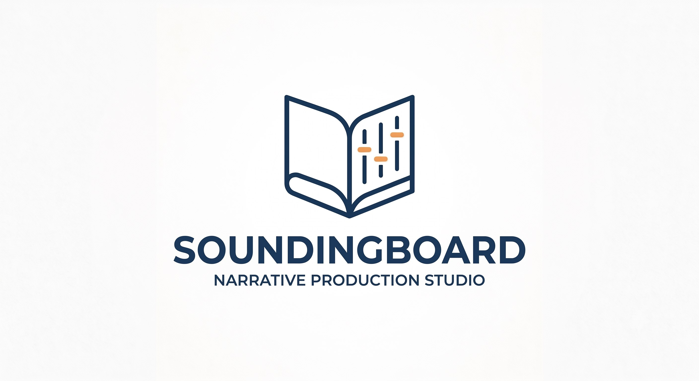

  

<h2 align="center">The Author's Intelligent Sounding Board &amp; Novel Production Studio</h2>

<em>A disciplined workspace and structural sounding board for novelists collaborating with AI agents.</em>

  
  
  
  
  
  

---

## Writing a Novel is Hard. Most AI Tools Make It Worse.

If you are a creative writer who has experimented with AI writing tools, you have likely felt the deep frustration of machines that try to seize the keyboard:

* **The Dread of Voice Flattening:** Autonomous AI rewriters strip away your personal style, quirky cadences, regional dialects, and raw emotional texture—sanding your prose down into polite, homogenous corporate sludge.
* **The "40,000-Word Murk":** Deep in the messy middle of a book, you spend precious writing hours cross-referencing notes to remember what color Lord Corvus's eyes were in Chapter 2, whether the alchemist's key was silver or brass, or when a dormant subplot was last mentioned.
* **Outlining Paralysis vs. Discovery Chaos:** Rigid plotting software forces you to plan every chapter before writing a word, while freeform blank documents leave you drowning without structural guidance.
* **The Black-Box Rewrite Trap:** When conventional AI tools offer edits, they dump wholesale rewrites into your document, leaving you wondering what changed, destroying your subtext, and stealing your artistic ownership.

**Soundingboard was built on a radically different premise:**

> **The author is the novelist. The AI is the Executive Editorial Assistant, Continuity Sentry, Master Librarian, and Craft Sounding Board.**

---

## The Foundational Values Built Into Soundingboard

1. **The System Bends to the Author, Never the Other Way Around:**
   You set the tempo. Work in whatever mode and tool you love:
   - **Solo Mode:** You write 100% of the prose in your favorite editor (Obsidian, Scrivener, Microsoft Word, iA Writer, VS Code). The AI operates strictly as your tireless librarian, continuity tracker, and diagnostic reader.
   - **Hybrid Mode:** You and the AI volley beats, bounce brainstorms, unstick tangled plot logic, or bloom sensory details together.
   - **Generative Mode (On Demand Only):** The AI drafts scenes from your beat sheets *only when you explicitly request it*.
2. **The Scene is the Atomic Dramatic Quantum:**
   Chapters are packaging, pacing, and reading-experience choices; scenes are the true dramatic events. In Soundingboard, scenes exist as independent, atomic units with their own POV, emotional value shifts, and 5-commandment turning points. You can write the climax first, draft an unassigned scene, or restructure your chapter playlists without ever breaking a file path.
3. **The Red Pen Stays in the Human's Hand (The Bracket Method):**
   The AI **never silently or unilaterally rewrites your prose**. 
   - **In Developmental Editing:** Suggestions and structural directions are quarantined in brackets `[like this]` using Dwight Swain's Motivating-Reaction Unit (MRU) sequencing, preserving your prose verbatim.
   - **In Prose Diagnostics & Linting:** AI-tell scans and rhythm diagnostics present bracketed choices (`[AI-TELL: Cliché idiom. Option A: Cut. Option B: Physical action. Option C: Keep as author voice]`). You hold the red pen; the AI never makes changes to get a "green checkmark."
4. **The Writer's Room: An Inviolable Creative Sanctuary:**
   Brainstorming and raw drafting happen in `writers_room/` (`notes/`, `beats/`, `drafts/`, `inputs/`). Background linters and automated tests are strictly locked out by an **Immunity Shield**. Write as messy and raw as you want without being nagged by premature schemas or audit errors. When you decide a scene is ready, you graduate it to the formal manuscript pool.
5. **Scale-Adaptive Complexity ("From Napkin to Universe"):**
   *Abstraction is a complexity valve, not a publishing contract.* Soundingboard flexes dynamically across four progressive tiers:
   - **Tier 0 (The Napkin):** Frictionless `writers_room/` sandbox with on-demand tools.
   - **Tier 1 (The Atomic Story):** Standalone novel production in `stages/` with local `canon.md` (< 4,000 tokens).
   - **Tier 2 (The Institutional Canvas):** Multi-volume continuity in `series/` for cross-book character states, romance ladders, and lore debt.
   - **Tier 3 (The Cosmos Universe Canvas):** Deep worldbuilding in `world/` governed by `world/CONTEXT.md` across 6 ICM semantic domains (`cosmology`, `chronology`, `geography`, `cultures`, `economy`, `factions`) with Dynamic Context Isolation (< 6,000 tokens).
6. **The 5 Foundational Principles of Authorial Sovereignty:**
   - *Authorial Truth is Absolute:* An explicit author statement overrules all inferences, schemas, and prior drafts.
   - *Explicit Uncertainty > Premature Precision:* Flag ambiguities as open choices `[Option A | Option B]`; never invent synthetic facts to plug gaps.
   - *Inference is Never Canon:* Inferred lore remains quarantined with `[unverified]` until the author affirms it.
   - *Dramatic Consequences are Invitations:* Propose ripple effects and frictions as creative prompts, never as mandates.
   - *Intentional Exceptions are Valid:* Facts tagged `[author exception]` represent deliberate narrative sovereignty (miracles, anomalies, rule-breaks) and are never flagged as defects.
7. **Creative History & Git as Evolution Layer (Playbook #21):**
   *Soundingboard files contain the meaning. Git records the evolution.* Git is an open, non-proprietary historical layer over your file-first workspace—never a competing database. Checkpoints and pushes occur **only when you say to**. Malformed syntax is blocked to prevent repository corruption, while creative uncertainty (pacing, tells) remains completely unblocked.
8. **No Black-Box Vector Databases:**
   Built on the *Interpretable Context Methodology* (ICM, arXiv:2603.16021), your story's memory lives entirely in human-readable plain markdown files (`canon.md`, `threads.md`, `preferences.md`, `world/`). Open them in any text editor to see exactly what your assistant knows.

---

## Write Where You Want, How You Want

Soundingboard seamlessly accommodates your natural authorial habitat:

* **Direct in the Project Folder (Obsidian, VS Code, iA Writer, Zed):**
  Open the Soundingboard novel folder directly as an **Obsidian Vault** or local markdown workspace. Write your notes in `writers_room/notes/` and your drafts in `writers_room/drafts/`. Soundingboard acts as the ambient operating system living quietly inside your vault.
* **External Ingestion (Scrivener, Microsoft Word, Google Docs):**
  Love writing in Scrivener or Word? Keep writing there. When you complete a draft, simply drop it into `writers_room/inputs/` or run `node scripts/soundingboard.js ingest <file>`. The engine immutably archives your raw file, formats atomic scenes, and automatically harvests proper nouns into your canon ledger tagged `[unverified]`.
* **Author Collaboration Preferences (`preferences.md`):**
  Right at your workspace root, a plain-text `preferences.md` profile lets you declare your working mode (`solo`, `hybrid`), primary editor, prose boundary (`ai_prose_generation: "never"`), and diagnostic tolerance. Edit it anytime; your AI partner immediately adapts.

---

## The 5 Creative Studio Workspaces

Soundingboard organizes novel production into five disciplined, author-paced workspaces:

  

### 1. 🛋️ The Discovery Lounge (Stage 01 · Onboarding)
A relaxed story and genre discovery interview. Your assistant helps you define your core premise, genre chassis, trope stack, and primary cast. It establishes your root `preferences.md` and creates an **In-World Allowlist** so unique in-universe terms aren't flagged as clichés.

### 2. 📋 The Storyboard Wall (Stage 02 · Planning)
Architect your story's spine without outlining paralysis. Map your **1-Page Foolscap Roadmap**, track narrative subplots in `threads.md`, ledger obligatory genre scenes, and design scene cards with clear emotional value shifts (`value_in` ➔ `value_out`).

### 3. ✍️ The Writing Desk & Writer's Room (Stage 03 · Drafting)
Write freely in `writers_room/` or draft against focused scene kits:
* **The Ambient Desk Kit:** Ask your agent for your scene briefing to get a tight 1-page summary of characters in the room, active secrets, sensory registers, and a same-POV voice anchor before you write.
* **Scene Frontmatter Assistance (Playbook #19):** Whenever you want, ask the AI to infer dramatic frontmatter from your prose, generate a scaffold with in-world suggestions, or talk through the turning point in chat.
* **The Graduation Ceremony:** When a draft is ready, graduate it into `manuscript/scenes/sc-XXXX.md`. It enters your canonical scene pool, safe and indexed, whether assigned to a chapter yet or floating freely.

### 4. 🔍 The Editorial Desk & Diagnostics (Stage 04 · Feedback)
An advisory diagnostic suite that respects human voice:
* **Sub-500ms Scoped Audits:** Instant scans for cadence variance, sensory balance, dialogue ratios, and synthetic tell-words.
* **The Linter Bracket Workflow (Playbook #20):** Diagnostic findings are framed as bracketed choices, never silent file edits.
* **The Bracket Method for Developmental Editing (Playbook #18):** Restructure cause-and-effect flow, tighten Coyne micro-beats, and fix Swain emotional sequencing while preserving your prose word-for-word.
* **Thread Sentry & Visualizer:** Detect dormant subplots and orphan scenes, and inspect interactive visual timelines via `node scripts/soundingboard.js threads --view`.
* **Canon 2.0 & Spoiler Guard:** Automatically flags orphaned facts and suppresses future story spoilers from early chapter continuity checks.

### 5. 🖨️ The Printing Press (Stage 05 · Publishing)
Assemble atomic scenes into chapter playlists (`manuscript/chapters/ch-XX.md`) with authored chapter break rationales. A single command compiles your book into publication-ready, typeset **HTML** and standard **EPUB** formats with configurable scene break dividers (`***`, blank space, or custom glyphs).

---

## Quickstart for Writers

You don't need programming experience or complex command-line setups:

1. **Clone or download** this repository to a folder on your computer.
2. **Open the folder** in **Google Antigravity**, **Claude Code**, **Cursor**, or your favorite agent harness.
3. **Start the conversation in chat:**
   > *"Read AGENTS.md and let's brainstorm my novel."*
4. Your agent will read your `preferences.md`, adopt your preferred writing mode, and assist you at your pace.
5. **Check for updates safely:** Check for new craft modules and refined diagnostics anytime by asking your agent (*"Check for Soundingboard updates"*) or running `node scripts/soundingboard.js check-update`. Updates automatically create timestamped safety snapshots in `.soundingboard/backups/` and never touch your story files.

---

## Codified Narrative Craft: The 127-Module Library

Soundingboard equips your agent with 127 codified reference modules in `_config/okf_craft/` synthesizing time-tested storytelling theory:
* **The Story Grid (Shawn Coyne):** Five Commandments of the scene quantum, value progression, and genre obligatories.
* **The Anatomy of Story (John Truby):** Moral arguments, designing principles, and 4-corner opposition webs.
* **Sanderson's Laws of Magic:** Hard vs. soft systems, costs, limitations, and escalating consequences.
* **Character Arc Anatomy (K.M. Weiland):** The Lie, the Wound, the Want vs. the Need, and transformative shift.
* **Techniques of the Selling Writer (Dwight Swain):** Motivation-Reaction Units (MRUs) for visceral pacing.
* **Scale-Adaptive Architecture & Onomastics:** Four complexity tiers ("Napkin to Universe"), phonotactic name generation, and deep worldbuilding across 6 ICM domains.
* **Universal Narrative Rosetta Stone:** Instant translation across *Story Grid*, *Save the Cat!*, *Hero's Journey*, and *Story Circle* vocabularies.

---

## Explore the Architecture & Methodology

For developers, technical authors, or curious creators who want to inspect the plumbing:

* 📖 **[The Science of Narrative Authenticity](docs/methodology.md):** The *StoryScope* research, why plain folders beat vector databases, and the Interpretable Context Methodology (ICM).
* 📜 **[Git Playbook & Creative History](docs/git_playbook.md):** How Git records the evolution of your file-first workspace, author checkpoint modes, and branch experiments.
* ⚙️ **[Technical Architecture & CLI Reference](docs/architecture.md):** The 2.0 flat scene pool architecture, scale-adaptive complexity tiers, 6 ICM world domains, and zero-dependency Node engine.
* 📚 **[Narrative Craft Encyclopedia & Rosetta Stone](docs/craft_encyclopedia.md):** Complete catalog of the 127 OKF craft cards, theory lineages, and symptom-based search.
* 🤝 **[Contributing Guide](CONTRIBUTING.md):** Architectural invariants, zero-dependency requirements, and PR checklists.

---

## Inspiration & Dedication

Soundingboard stands on the shoulders of brilliant researchers, open-source pioneers, and a real-life creative partnership:

* **For Axie:** Dedicated with love to my partner, **Axie**, an author for whom I have served as a personal sounding board across years of late-night brainstorming, worldbuilding, and plot puzzles. Soundingboard was built from that exact creative rhythm—engineered so that AI can finally keep up with her boundless imagination the way a devoted human partner can.
* **Jake Van Clief & David McDermott (ICM):** Boundless credit for the foundational breakthrough of the *Interpretable Context Methodology* ([ICM, arXiv:2603.16021](https://arxiv.org/abs/2603.16021)). Their philosophy—that transparent, plain-text folder architectures and token-disciplined contracts beat black-box vector databases—provides the structural spine of this studio.
* **Nous Research (`autonovel`):** Gratitude to the team at Nous Research, whose early *autonovel* experiments proved that AI could tackle long-form fiction and inspired the quest to give writers a true, disciplined creative sounding board.

---

## License

MIT License. Designed with care for novelists, storytellers, and creative partners.
