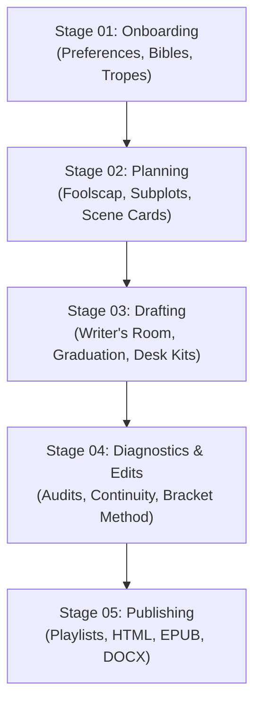

# Soundingboard 2.0 — Executive Author's Guide & Overview
## The Creative Concierge, Master Librarian & Continuity Sentry for Novelists

Writing a novel is a deeply personal, complex, and creative journey. Standard software project tools are far too rigid, while generic AI text generators are formless and intrusive—flattening authorial voice, inventing hallucinations, and attempting to ghostwrite your manuscript.

**Soundingboard 2.0** is built on a fundamentally different philosophy:

> **The author is the novelist; the system bends to the author, never the author to the system.**  
> **The human author always holds the red pen. The AI never unilaterally rewrites author prose.**

Whether you write in **Obsidian**, **Scrivener**, **Microsoft Word**, **iA Writer**, or plain markdown, Soundingboard serves as your **Executive Novel Assistant, Master Librarian, Continuity Sentry, and Diagnostic Partner**—protecting your voice, tracking your threads, and organizing your manuscript at your pace.

---

## 1. Core Principles of Soundingboard 2.0

1. **Solo & Hybrid First (You Write the Words):**  
   - **Solo Mode (Default):** You write 100% of the prose in your favorite editor. The AI acts as your Librarian, Continuity Sentry, and Diagnostic Partner. It *never* alters your words without an explicit request.
   - **Hybrid Mode:** You and the AI volley beats, brainstorm alternate plot branches, or bloom sensory details via **The Bracket Method**.
   - **Agentic Drafting:** The AI drafts prose *only upon explicit request*. It is never the default or assumed workflow.

2. **Universal Tool Freedom:**  
   - **In-Vault Writing:** The project folder can function directly as an **Obsidian vault** or markdown directory.
   - **External Ingest:** Prefer drafting in Scrivener, Word (`.docx`), or Google Docs? Simply drop your files into `writers_room/inputs/` or run `soundingboard ingest <file>`.

3. **The Red Pen Stays in Your Hand (Zero Black-Box Rewrites):**  
   - The AI never executes silent rewrites to satisfy a linter or audit.
   - All critiques and diagnostic findings use **The Bracket Method** (Playbooks #18 & #20). Suggestions are quarantined in inline brackets (`[like this]`) with 3 clear choices: *Cut*, *Rephrase*, or *Keep as author voice*.

4. **Scene is the Atomic Dramatic Quantum; Chapters are Playlists:**  
   - Completed scenes live in a unified flat pool: `manuscript/scenes/sc-XXXX.md`.
   - Chapters in `manuscript/chapters/ch-XX.md` are flexible assembly playlists with an authored break rationale.
   - You can write your climax first or draft standalone scenes without assigning them to a chapter yet. Floating scenes remain 100% valid and audited.

5. **Markdown as Ground Truth:**  
   - Your markdown files are the sole record of truth.
   - `manuscript.json` is a derived cache that can be deleted and reconstructed losslessly at any time with `node scripts/soundingboard.js reindex`.

---

## 2. The Writer's Room & Inviolable Immunity Shield

Creativity requires an uninhibited, judgment-free space to explore. Soundingboard provides a dedicated sandbox in `writers_room/`:

```
writers_room/
├── notes/      # Character sketches, aesthetic moodboards, lore fragments
├── beats/      # Scratchpad sequences, beat sheets, rough outlines
├── drafts/     # Raw work-in-progress prose drafted by you
└── inputs/     # Dropped external files from Scrivener, Word, or Google Docs
```

### 🛡️ The Immunity Shield
- Background linters, automated audits, continuity checkers, and test runners **strictly ignore** `writers_room/`.
- You can draft half-finished paragraphs, fragment bullet notes, and messy first takes with zero automated red ink.
- When—and only when—you want feedback on a draft, you can explicitly ask (e.g., *"Audit the cadence of `writers_room/drafts/heist_arrival.md`"*).

---

## 3. Scene Graduation & Frontmatter Assistance (Playbook #19)

Drafting in the Writer's Room requires zero metadata or frontmatter. When a scene is in a good place and you are ready to bring it into the manuscript pool, you invoke the **Scene Graduation Ceremony**:

```bash
node scripts/soundingboard.js graduate writers_room/drafts/my_scene.md
```

### Three Ways to Complete Frontmatter
Frontmatter (POV, location, value shifts, 5 commandments, threads) provides the dramatic metadata needed for high-level developmental diagnostics. The AI assists through three painless pathways:

1. **Path 1 (AI Proposal):** The assistant reads your draft prose and proposes all frontmatter fields for your review and approval.
2. **Path 2 (Author Scaffold):** The assistant inserts a clean YAML block with relevant in-world suggestions (characters from `canon.md`, open threads from `threads.md`) commented inline for you to fill out.
3. **Path 3 (Conversational Discovery):** You and the assistant discuss the scene's turning point, stakes, and crisis question in chat, and the assistant generates the frontmatter block.

Once graduated, the scene is assigned a canonical ID (`sc-XXXX`), moved to `manuscript/scenes/`, indexed into `manuscript.json`, and any new proper nouns are harvested into `canon.md` tagged `[unverified sc-XXXX]`.

---

## 4. The 5-Stage Author-Paced Pipeline

Soundingboard organizes the novel lifecycle into five stages. These stages are **architectural lenses, not a rigid railroad**:



| Stage | Folder | What Happens | Key Outputs |
|---|---|---|---|
| **01. Onboarding** | `stages/01_onboarding/` | Discovery interview, root author preferences, character & world bibles, trope stack. | `preferences.md`, `world_bible.md`, `character_bible.md`, `genre_bible.md` |
| **02. Planning** | `stages/02_planning/` | High-level architecture: 1-page Foolscap outline, subplot thread ledger, scene cards. | `foolscap.md`, `threads.md`, `scene_cards/` |
| **03. Drafting** | `stages/03_drafting/` | Active writing in the Writer's Room, desk kits, frontmatter assistance, scene graduation. | `writers_room/`, `manuscript/scenes/sc-XXXX.md` |
| **04. Diagnostics** | `stages/04_diagnostics_edits/` | AI tell density scans, sentence rhythm variance, thread continuity, Bracket Method editing. | Audit reports, `thread_lanes.html`, revision brackets |
| **05. Publishing** | `stages/05_publishing/` | Curate chapter playlists, verify scene existence, compile to publication formats. | `manuscript/chapters/ch-XX.md`, `manuscript.html`, `.epub`, `.docx` |

---

## 5. The Diagnostic & Sentry Suite

Soundingboard provides an industrial-grade diagnostic suite to keep your manuscript cohesive over 80,000+ words:

### ⚡ Sub-500ms Scene Diagnostics (`soundingboard audit`)
- **Lexical Tell Density:** Flags repeated AI-fingerprint phrasing (e.g., *testament, tapestry, palpable, intricate*) normalized per 1,000 words.
- **Sentence Rhythm Variance:** Analyzes sentence length standard deviation and coefficient of variation to prevent monotonous prose cadence.
- **Emotional Mode Tracking:** Verifies shift between interior monologue, visceral reaction, and dialogue.

### 🎭 Chapter Cadence & Break Audits (`soundingboard chapter-audit`)
- Evaluates multi-scene pacing rhythm across a chapter.
- Audits chapter break efficacy against your authored `break_rationale`.

### 🧵 Thread Diagnostics & Interactive Visualizer (`soundingboard threads`)
- **Orphan Guard:** Detects and flags scenes with zero subplot linkages.
- **Dormancy Tracker:** Calculates cumulative word count gaps between thread appearances to ensure subplots aren't forgotten.
- **Dual Visualizer:** Renders instant ASCII timelines in the terminal and generates a standalone, zero-dependency interactive HTML dashboard (`thread_lanes.html`) with SVG trajectories, value shift markers, and multi-thread braid points.

### 📖 Cascading Canon 2.0 & Decision Queues (`soundingboard canon`)
- **Provenance Tracking:** Every world fact is tied to its establishing scene.
- **Spoiler Threshold Guard:** Suppresses future facts when working on earlier chapters.
- **Epistemic Gap Queues:** Automatically surfaces orphaned facts (when an establishing scene is cut), unbound proper nouns (recurring names not in canon), and unverified facts.

### 🩺 Model Health Console & Doctor (`soundingboard status` / `doctor`)
- **Health Console:** Instant telemetry on chapter break rationales, value shifts, voice anchor stability, and SHA-256 prose hash staleness.
- **Concierge Auto-Healing:** `node scripts/soundingboard.js doctor --fix` automatically verifies Node environments, repairs directory structures, and syncs git tracking behind the scenes.

### 📚 OKF Craft Encyclopedia
- **118 Standardized Craft Cards:** Distilled narrative wisdom covering Story Grid, Save the Cat!, Truby, and Sanderson.
- **Structural Scopes:** Searchable by scope (`scene`, `chapter`, `manuscript`, `sentence`) and genre.

### 📜 Git Playbook & Creative History (`soundingboard git`, Playbook #21)
- **The Golden Rule:** *Soundingboard files contain the meaning. Git records the evolution.*
- **Historical Layer, Not a Database:** Git sits as a non-proprietary record over your plain files, preserving draft evolutions, bracket resolutions, and structural experiments.
- **Author Sovereignty:** Checkpoint commits and remote pushes are created **only when you say to**. The AI never commits or pushes behind your back.
- **Stable Scene Identity:** Moving scenes between chapters reorders playlists; the scene's ID (`sc-XXXX`) and frontmatter context remain permanent.
- **Non-Blocking Feedback:** Editorial findings never block commits; technical integrity (syntax/validity) protects the workspace.

---

## 6. Author Preferences Profile (`preferences.md`)

Located at the root of your project, `preferences.md` allows you to customize how the assistant interacts with you:

```yaml
---
author_name: "Your Name"
working_mode: solo            # solo | hybrid | agentic
primary_editor: obsidian      # obsidian | word | scrivener | ia_writer | markdown
ai_prose_generation: "never"  # never | on_demand | collaborative
editorial_style: bracket_options # bracket_options | coaching_notes | minimalist
tell_tolerance: moderate      # strict | moderate | permissive
active_genre: "thriller"
target_word_count: 85000
---
```

---

## 7. How to Talk with Your Assistant

As an author, you never need to remember complex syntax or technical flags. Your AI partner operates as an attentive **Creative Concierge**:

- **To start a new book:**  
  *"Let's start the onboarding interview for my new sci-fi novel."*
- **To check your manuscript health:**  
  *"How is our story model looking? Run status and give me the highlights."*
- **To work through a rough scene:**  
  *"I dropped rough prose into `writers_room/drafts/escape.md`. Help me brainstorm the frontmatter and turning point."*
- **To graduate a scene:**  
  *"The escape scene is ready. Let's graduate it to the manuscript."*
- **To review prose without rewriting:**  
  *"Audit `sc-0004` using the Bracket Method and show me options for any repetitive tells."*
- **To assemble a chapter:**  
  *"Let's create Chapter 2 from scenes `sc-0003` and `sc-0004` with a break rationale on the betrayal."*
- **To compile your book:**  
  *"Compile the manuscript to HTML and EPUB."*

Your assistant runs all the mechanics backstage and presents clear, encouraging craft choices—always proposing two concrete next steps matching your active rhythm.
