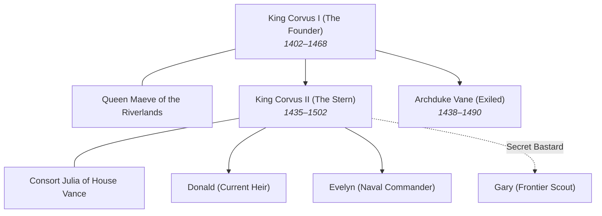

# Dynastic Genealogy & Succession Ledger: [House Name]

*Maps the generational descent, legitimate vs. contested bloodlines, marital alliances, and succession claims governing sovereign power.*

---

## 1. The Active Succession Line

| Order | Claimant Name | Relation to Ruler | Legitimacy Status | Backing Faction | Fatal Flaw / Vulnerability |
|:---:|---|---|---|---|---|
| **1st** | [e.g. Prince Donald] | Eldest son | Fully legitimate | High Clergy & Smelters | Sickly, indecisive, secret apostate |
| **2nd** | [e.g. Princess Evelyn] | Eldest daughter | Legitimate (bypassed by law) | Fleet Captains | Ruthless, commands private mercenaries |
| **3rd** | [e.g. Gary Snow / Bastard]| Acknowledged bastard | Disinherited by royal decree | Frontier Border Guards | Possesses the ancestral blade & popular love |
| **Usurper** | [e.g. Duke Cassian] | Monarch's brother | Collateral line | Merchant Cartels | Holds debts on the crown's treasury |

---

## 2. Lineage Tree & Generational Descent

---

## 3. Contested Bloodlines & Dynastic Secrets

- **The Secret Bastard or Swapped Infant:**
  - *Who knows the truth?* `[Names of sworn witnesses or nursemaids]`
  - *The Physical Proof:* `[Unique eye color, birthmark, hereditary resistance to poison]`
- **The Broken Betrothal:**
  - *The Promise:* `[Marriage pact signed 20 years ago with rival house]`
  - *The Consequences of Violation:* `[Loss of northern fleet, immediate war]`

---

## 4. Marital Alliances & Hostage Fosterage

| Sovereign House | Bound By | Key Figure Involved | Hostage / Ward Exchanged | Status |
|---|---|---|---|---|
| [House Vance] | Royal Marriage | Queen Julia | None | Active / Tense |
| [Iron Clan] | Wardship Treaty | Gary Snow fostered at border | Son of Clan Chief held in capital | Fragile Peace |
